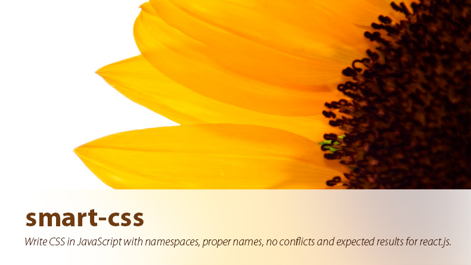

[](https://travis-ci.org/hackhat/smart-css) [](https://coveralls.io/r/hackhat/smart-css?branch=prod) [](https://gitter.im/hackhat/smart-css?utm_source=badge&utm_medium=badge&utm_campaign=pr-badge)

Write CSS in JavaScript with namespaces, proper names, no conflicts and expected results for react.js. ([Why writing CSS in JS is better than SCSS or CSS files?](https://speakerdeck.com/vjeux/react-css-in-js))

Read the **[API](https://rawgit.com/hackhat/smart-css/v1.0.2/docs/jsduck/index.html)**, check out an [example](https://github.com/hackhat/fluxmax-smart-css/tree/ui-test) or the [cookbook recipes](#cookbook-recipes-specific-examples).


## Quick example

```javascript
var SmartCSS = require('smart-css');
var css      = new SmartCSS();
var React    = require('react');

css.setClass('.button', {
    background: 'red'
})

var comp = React.DOM.button({
    className: css.getClass('button')
}, 'press-me')

// This will inject a `<style>` tag in the head of the document 
// and it will add the following CSS:
// `.button0{background:red}`
SmartCSS.injectStyles();

React.renderComponent(comp, document.body);
```

**Generated CSS**
```css
.button0{background:red}
```


## Get started

Is very easy to get started:

 - Install the library with `npm install smart-css --save`;
 - Use it in your app like this:

**componentA.js:**
```javascript
// Creates a new namespace/context with the `css` variable where you 
// add the componentA's styles.
var SmartCSS = require('smart-css');
var css      = new SmartCSS();
var React    = require('react');
// You can name a style without worring about other
// components because you are adding all the styles
// to the componentA only.
css.setClass('.root', {
    background: 'red'
})
css.setClass('.root:hover', {
    background: 'green'
})

React.createClass({
    render: function(){
        return React.DOM.div({
            // This will return a string with the classes that you set
            // true.
            className : css.getClass('root')
        })
    }
});
```

**componentB.js:**
```javascript
// In
// Creates a new context, only for componentB.
var SmartCSS = require('smart-css');
var css      = new SmartCSS();
var React    = require('react');
// Notice how we used the exact class name as componentA's.
// This is the power of namespaces, you can keep the name
// you want without worrying about conflicts with other
// classes you defined.
css.setClass('.root', {
    background: 'yellow'
})
css.setClass('.colorBlue', {
    color: 'blue'
})
// Here you can use pure css, so when the element with the 
// `root` class is hovered the element with class `link`
// will have the color set to green.
css.setClass('.root:hover .link', {
    color: 'green'
})

React.createClass({
    render: function(){
        return React.DOM.li({
            className : css.getClasses({
                root      : true,
                colorBlue : true,
            })
        },
            React.DOM.a({
                className: css.getClass('link')
            })
        )
    }
});
```

**index.js:**
```javascript
// Then apply all the styles, only after this command is ran
// your styles are added to the DOM.
require('./componentA');
require('./componentB');
SmartCSS.injectStyles();
```

**Generated CSS string**
```css
.root1{background:red;}.root1:hover{background:green;}
.root2{background:yellow;}.colorBlue3{color:blue;}.root2:hover .link4{color:green;}
```

Notice how you have defined the "root" class twice but there is no conflict because this library automatically adds an id to have no conflicts.


## Features

 - Easy to know which styles are applied to a certain element because:
   - Styles are in the same file as the element definition;
 - You don't have to worry about which styles are applied to your component because:
   - You know that no other style will have any effect on your element;
   - A new developer can come and create a component without having to look at any
     existing CSS code.
 - Integrates perfectly with the react.js way to thought;
 - You don't need to use the singleton to render the CSS;
 - Can handle transitions in react (yes, you can write custom class names);
 - Works on node.js;


## Roadmap

 - Add auto prefix for vendors;
 - Find a better way to handle measurements;
 - Find a better way to set certain properties that are difficult to be written as string; For example write an object instead of a big nasty string;
 - Make a plugin for webpack to output the CSS to a CSS file for production mode;


## Cookbook recipes (specific examples)


### Get classes

There are 2 ways to get classes. If you need only one then `getClass` is the best:

```javascript
css.setClass('.a', {
    background: 'red'
})
// In your render()
React.DOM.div({
    className: css.getClass('a');
})
```

If you need more than one class then you can use this syntax:

```javascript
css.setClass('.a', {
    background: 'red'
})
css.setClass('.b', {
    color: 'white'
})
// In your render()
React.DOM.div({
    className: css.getClasses({
        a: true,
        b: true
    })
})
```

Notice how you can set each class to true or false. This allows you to integrate logic very easily in your view styles.


### Add a hover style ([pseudo classes](https://developer.mozilla.org/en-US/docs/Web/CSS/Pseudo-classes))

When you hover over the element with the class id ".root" it will change the background from red to blue.

```javascript
css.setClass('.root', {
    background: 'red'
})
css.setClass('.root:hover', {
    background: 'blue'
})
```


### Add a hover style on parent

When you hover over the element with the class id `.root` it will change the background of the child element with class id `.a` from red to blue.

You have to define both `.root` and `.a` before using the `.root:hover .a` tag.

```javascript
css.setClass('.root', {
})
css.setClass('.a', {
    background: 'red'
})
css.setClass('.root:hover .a', {
    background: 'blue'
})
```


### No need to use the singleton to create the CSS string

As you might already know, singletons are a bad practice in software design. This leads to unexpected bugs which can propagate in unexpected ways. In order to avoid this bad design you can use child contexts. Here the `injectStyles` method injects the styles of the `cssParent` and `cssChild` css instances.

```javascript
var cssParent = new SmartCSS({});
cssParent.setClass('.a', {color: 'red'});
var cssChild = new SmartCSS({});
cssChild.setClass('.a', {color: 'red'});
cssParent.addChildContext(cssChild);
cssParent.injectStyles();
```


### Force class name

Sometimes you might want to force a custom class name. Notice that a class name is automatically generated and you only specify the class id by default.

```javascript
css.setClass('.root', {
    background: 'red'
}, {className: 'my-root'})
```

The above code will create the css class name `.my-root`. This should be used for react transitions.


### Media property

```javascript
css.setClass('.myClassName', {
    background: 'red'
}, {
    media: 'max-width: 500px'
});
css.setClass('.myClassName', {
    background: 'blue'
}, {
    media: 'min-width: 500px'
});
```


### Use a [pseudo element](https://developer.mozilla.org/en-US/docs/Web/CSS/Pseudo-elements) (like ::after, ::before)

```javascript
css.setClass('.root', {
})
css.setClass('.root::after', {
    content: '"test"'
})
```


### Content

If you want to add some nice effects with buttons like [these](http://codepen.io/seansean11/pen/wHIae) you need to use the `content` property. Because sometimes the value of the property can be a string and other times can be a function then you need to add `"`  around your strings.

```javascript
css.setClass('.root', {
    content: '"a string"'
})
```

If you want a function then you do this:

```javascript
css.setClass('.root', {
    content: 'attr(data-icon)'
})
```

Notice how the function doesn't have the extra `"`.


### Generate a more compressed CSS class names

There is a debug flag when you instance the SmartCSS. Turn it off in production mode, by default is true.

```javascript
var css = new SmartCSS({debug: false});
```


### Add prefix to the class names generated

Sometimes is easier to debug if you have a prefix on your styles based on the component.

```javascript
var css = new SmartCSS({
    name: 'componentA'
});
css.setClass('.root', {
    background: 'red'
})
```

The output will include the "componentA" string in the generated class name.


### Tinycolor

If you use tinycolor to create colors in JavaScript then you might find a pain to convert the tinycolor instance to a string. Because of this there is a helper which will automatically convert it to a HSL string.

```javascript
css.setClass('.root', {
    background   : tinycolor('red'),
    borderBottom : ['1px solid', tinycolor('blue')]
})
```

Notice how you added a background without using the `tinycolor('red').toHslString()` method. Another interesting point is using the array to define the `borderBottom`. If you use an array then it will be able to convert the `tinycolor('blue')` to a HSL string automatically.

Here would be an example without this feature (DON'T DO IT THIS WAY):

```javascript
css.setClass('.root', {
    background   : tinycolor('red').toHslString(),
    borderBottom : '1px solid ' + tinycolor('blue').toHslString()
})
```

Notice how much more code you write?
You can also define your colors with HEX or HSL syntax.


### More dynamic styles

Sometimes you might want a dynamic color. But this library already compiles all the CSS at runtime in one batch and there is no way to change existing styles. In order to add a dynamic property you need to use in-line styles like this:

```javascript
React.DOM.div({
    style: {
        backgroundColor: this.user.color
    }
})
```


## Roadmap

### Auto prefix specific vendors

### Enable to make themable styles

The css can't be static to do this. This should be done with some wrapper function which
receives some options about the theme.

### Find a better way to define data

For example setting the width of an element is done like this:

    width: '22px'

which is not optimal because the 'px'. Now if you want to increase the width by 5px you have to extract the number 22 from the string `22px`, increase 5 and then add the 'px'.


## Tests

Run tests:

 - With code coverage: `istanbul cover --root ./src --hook-run-in-context node_modules/mocha/bin/_mocha -- -R spec`
 - Without code coverage: `mocha`;


## Questions


### Q: If I want to change a style at runtime what should I do?

A: You can add inline styles like this: `style: {color: 'red'}` 


## More

This library is inspired from [RCSS](https://github.com/chenglou/RCSS). Thanks to [chenglou](https://github.com/chenglou).
